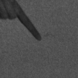
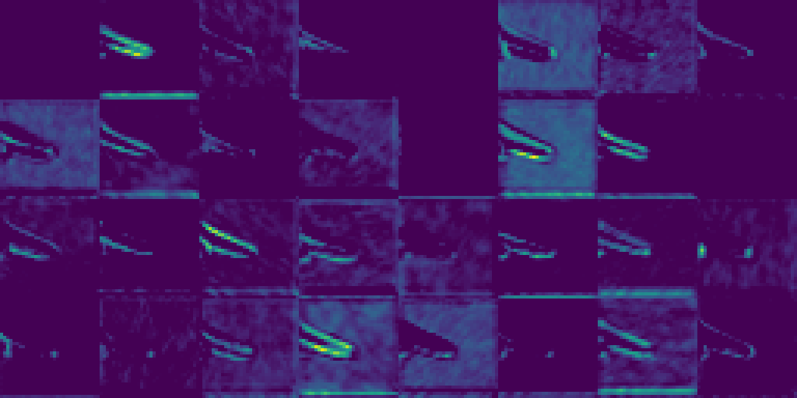
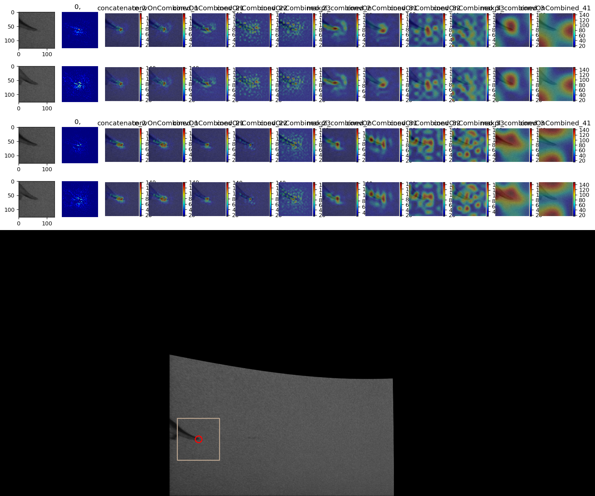

# Python Tools for Machine Learning Evaluation
This repository contains some of the python tools I developed during my second Co-op term.

## Generate_ROI_Pose.py
  - Given the coordinate, this file can crop the region of interest, and classify the result to different folders.
  - sample result:
  
  
  
  
 ## Generate_DetectFeatsRes.py
  - Given ROI and the classification model, this file can generate the visualization of intermediate activations for each image. 
  - sample outputs:
  
  
  max-min_layer_conv_23.png
  
  
  max-min_layer_conv_33.png
  
## Combine_Movie.py
  - Given visualization result images and detection result overlaid images, this tool can combine them together and output the combined image. After processing all of the images, the tool will combine the combined images to make a video. 
  - sample output:
  
  

